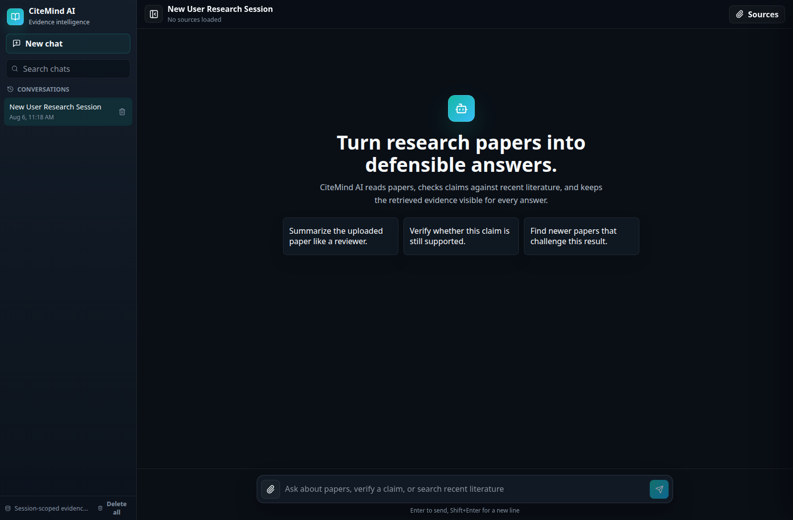
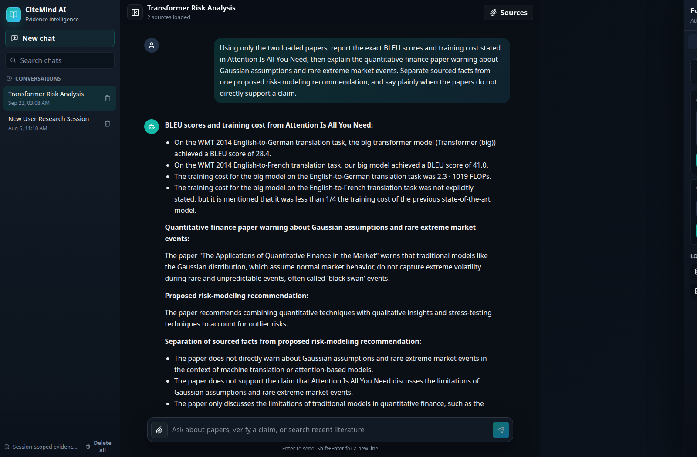
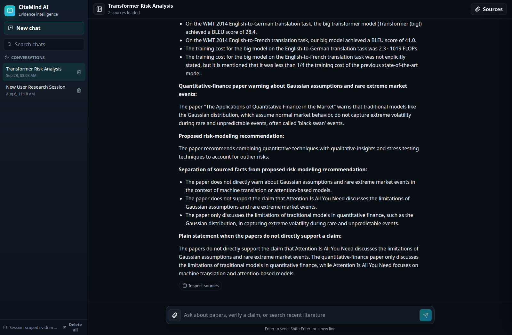
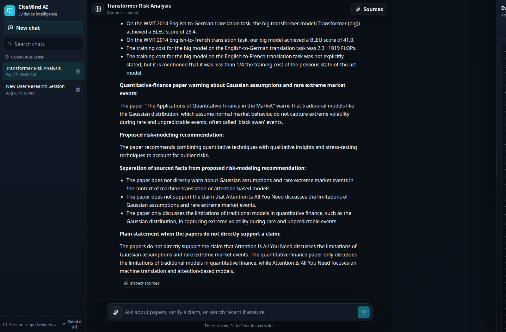
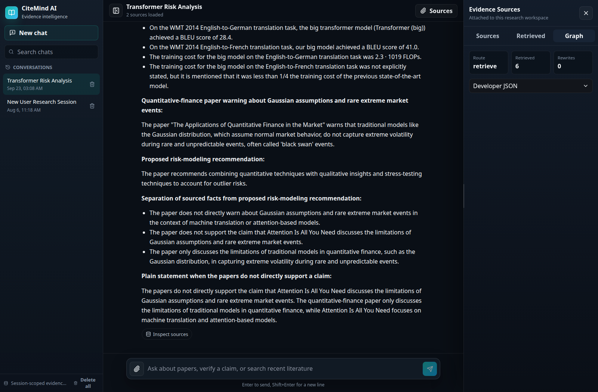
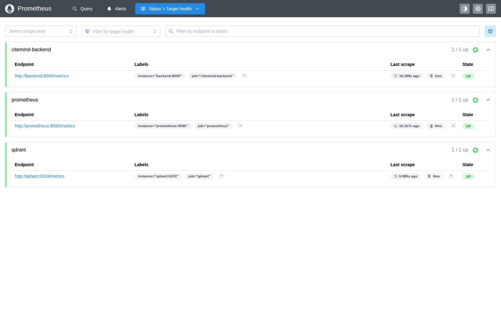
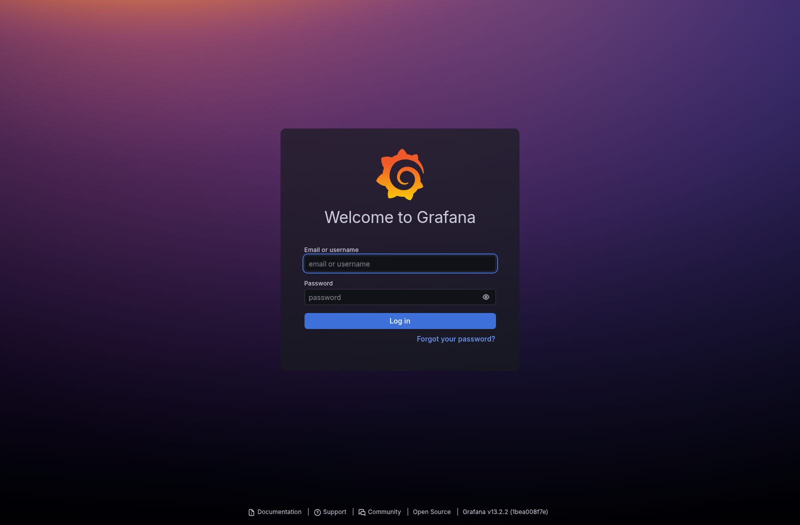
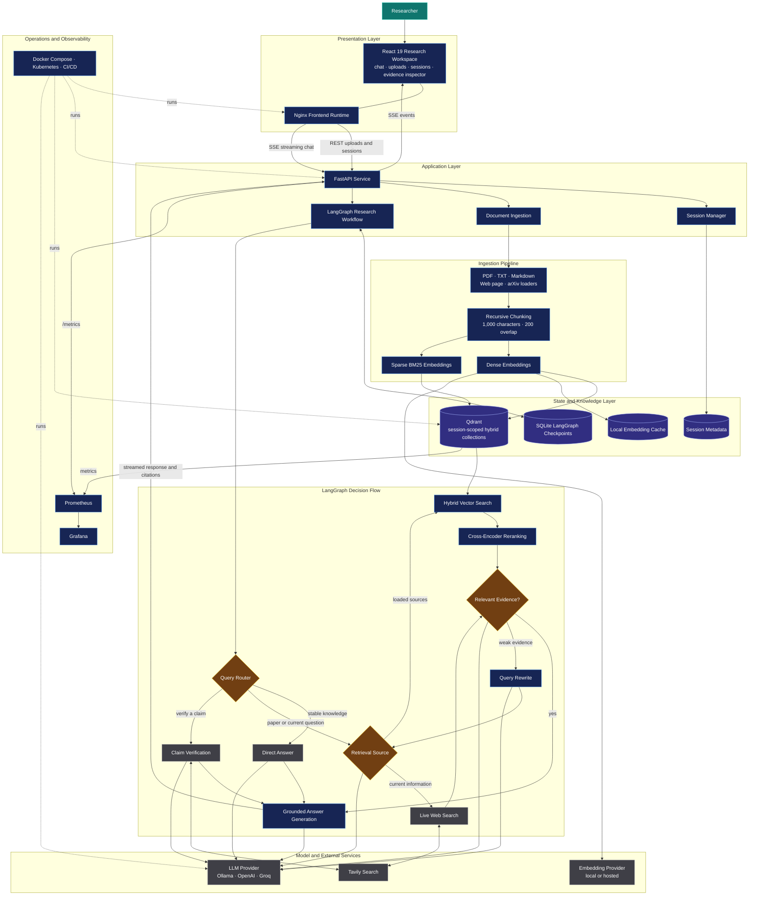

# CiteMind-AI-RAGOps

**CiteMind-AI-RAGOps** is a full-stack AI research assistant and cloud-native RAG platform that turns research papers, web pages, and arXiv sources into grounded answers with visible evidence. It combines document ingestion, hybrid retrieval, neural reranking, claim verification, streaming chat, and graph-state inspection in one production-oriented RAG application.

The project is designed to show practical AI engineering skill: backend orchestration with FastAPI and LangGraph, vector search with Qdrant, dense plus sparse retrieval, cross-encoder reranking, multiple LLM providers, and a polished React interface for research workflows.

## Why This Project Stands Out

Most RAG demos stop at "upload a PDF and chat." CiteMind AI goes further:

- **Hybrid retrieval** combines dense embeddings with BM25-style sparse search for stronger paper chunk recall.
- **Cross-encoder reranking** reorders retrieved passages before answer generation for better evidence quality.
- **LangGraph orchestration** routes questions through direct answer, paper retrieval, web search, claim verification, query rewriting, and answer generation paths.
- **Claim verification** searches recent literature and arXiv-targeted results to identify newer papers that may supersede a claim.
- **Session isolation** gives every chat its own document collection and research memory.
- **Streaming UX** sends model output through Server-Sent Events for a responsive chat experience.
- **Source inspection** exposes retrieved context and graph state so answers are auditable instead of black-box.
- **Provider flexibility** supports Ollama, OpenAI, and Groq through environment configuration.

## Product Preview

CiteMind AI helps a researcher or reviewer:

1. Upload a PDF, TXT, Markdown file, web page, or arXiv paper.
2. Ask source-grounded questions about the loaded material.
3. Verify whether a claim is still supported by newer literature.
4. Inspect retrieved passages and graph state behind each answer.
5. Keep separate research sessions with independent document memory.

Example prompts:

```text
Summarize the uploaded paper like a reviewer.
Verify whether this claim is still supported.
Find newer papers that challenge this result.
Which retrieved passages support your answer?
```

### Research workspace



The interface keeps conversations, session-scoped evidence, uploads, streamed answers, and inspection tools in one workspace.

The demonstration loads `Attention Is All You Need` and `The Applications of Quantitative Finance in the Market` into one isolated session. CiteMind retrieves evidence from both papers to answer a cross-domain question about reported Transformer results and financial models under rare market events.

| Multi-document ingestion | Grounded analysis |
|---|---|
|  |  |

| Retrieved evidence | LangGraph execution state |
|---|---|
|  |  |

### Operational visibility

| Prometheus targets | Grafana overview |
|---|---|
|  |  |

## Tech Stack

| Layer | Tools |
|---|---|
| Frontend | React 19, Vite, React Markdown, KaTeX, Lucide icons |
| Backend | FastAPI, Pydantic, Server-Sent Events |
| Agent Workflow | LangGraph, LangChain |
| Retrieval | Qdrant, dense embeddings, FastEmbed sparse BM25 |
| Reranking | Sentence Transformers CrossEncoder |
| Document Loading | PyMuPDF, LangChain loaders, arXiv API, web loaders |
| LLM Providers | Ollama, OpenAI, Groq |
| Evaluation | DeepEval-based RAG evaluation pipeline |
| Deployment | Docker, Docker Compose, Nginx frontend runtime, Kubernetes manifests, Prometheus, Grafana, GitHub Actions CI/CD |

## System Architecture



Important files:

```text
backend/api.py              FastAPI routes, sessions, uploads, SSE chat
backend/rag_graph.py        LangGraph workflow and routing logic
backend/vector_store.py     Qdrant hybrid retrieval and embedding cache
backend/reranker.py         Cross-encoder reranking layer
backend/paper_loader.py     PDF, text, Markdown, web page, and arXiv loaders
backend/providers.py        Ollama, OpenAI, and Groq provider selection
frontend/src/main.jsx       React application shell and chat workflow
frontend/src/styles.css     Professional dark research UI
evaluate.py                 RAG evaluation pipeline
docker-compose.yml          Full local stack with frontend, backend, Qdrant, Ollama
```

## Core Features

| Feature | What It Does |
|---|---|
| Paper Q&A | Ask questions over uploaded PDFs, text files, Markdown files, web pages, and arXiv papers. |
| Hybrid Search | Retrieves with dense semantic vectors and sparse BM25-style matching. |
| Reranking | Uses a cross-encoder to improve final context selection. |
| Claim Verification | Checks whether a research claim has been updated or superseded by newer literature. |
| Web Search | Uses Tavily for recent or external research context. |
| Direct Answer Routing | Sends stable general questions directly to the model when retrieval is not needed. |
| Query Rewriting | Rewrites weak retrieval queries when the first retrieved context is not relevant enough. |
| Source Inspector | Shows retrieved chunks and graph state for assistant turns. |
| Session Memory | Keeps independent chats, documents, and vector collections per session. |
| `/btw` Side Channel | Lets users ask off-topic questions without saving them into research history. |

## Local Development

### 1. Install Python Dependencies

This project uses `uv` and Python 3.12+.

```bash
uv sync
```

If you want caches to stay inside the project folder:

```bash
UV_CACHE_DIR=.uv-cache uv sync
```

### 2. Install Frontend Dependencies

```bash
cd frontend
npm install
```

### 3. Configure Environment

Create `.env` in the project root:

```env
LLM_PROVIDER=ollama
OLLAMA_BASE_URL=http://localhost:11434
OLLAMA_CHAT_MODEL=llama3.1
OLLAMA_EMBEDDING_MODEL=nomic-embed-text
OLLAMA_NUM_GPU=999
OLLAMA_NUM_CTX=4096

TAVILY_API_KEY=tvly-...
QDRANT_URL=http://localhost:6333
QDRANT_API_KEY=
QDRANT_COLLECTION_PREFIX=citemind
RERANKER_MODEL=BAAI/bge-reranker-v2-m3

# Optional provider alternatives
# OPENAI_API_KEY=sk-...
# GROQ_API_KEY=gsk-...
```

### 4. Run the Backend

```bash
uv run uvicorn backend.api:app --host 127.0.0.1 --port 8000 --reload
```

Health check:

```bash
curl http://127.0.0.1:8000/api/health
```

Expected response:

```json
{"status":"ok"}
```

### 5. Run the Frontend

In another terminal:

```bash
cd frontend
VITE_API_BASE_URL=http://127.0.0.1:8000 npm run dev
```

Open:

```text
http://127.0.0.1:5173
```

## Production-Style Local Run

Build the frontend and serve it through FastAPI:

```bash
cd frontend
npm run build
cd ..
uv run uvicorn backend.api:app --host 127.0.0.1 --port 8000
```

Open:

```text
http://127.0.0.1:8000
```


## DevOps and Cloud-Native Layer

CiteMind-AI-RAGOps includes a production-oriented DevOps layer around the RAG application:

| DevOps Area | What This Project Includes |
|---|---|
| Docker | Multi-stage backend/frontend image build with Compose orchestration |
| Kubernetes | Namespace, Deployments, Services, PVCs, Ingress, ConfigMap, and HPA |
| Observability | Prometheus scrape config and Grafana dashboard provisioning |
| CI/CD | GitHub Actions workflow for frontend build, Compose validation, Docker image build, and Kubernetes dry-run |
| Operations | Makefile commands for build, run, logs, cleanup, and K8s deployment |
| Reliability | Health checks, readiness probes, liveness probes, and persistent vector/model storage |

DevOps files added for portfolio review:

```text
Makefile                              One-command operational workflow
.github/workflows/ci.yml              CI/CD pipeline
k8s/                                  Kubernetes manifests
monitoring/prometheus.yml             Prometheus scrape configuration
monitoring/grafana/                   Grafana datasource and dashboard provisioning
```

Quick DevOps commands:

```bash
make build
make up
make logs
make compose-check
make k8s-apply
make k8s-status
make k8s-port-forward
```

Local observability endpoints when running Docker Compose:

```text
Application: http://127.0.0.1:8020
Prometheus:  http://127.0.0.1:9090
Grafana:     http://127.0.0.1:3000 (or the configured GRAFANA_PORT)
```

## Docker

Build and start the full stack:

```bash
docker compose build
docker compose up
```

Open:

```text
http://127.0.0.1:8020
```

Docker Compose includes:

- `frontend`: Nginx serving the React build and proxying `/api` to FastAPI.
- `backend`: FastAPI, LangGraph, ingestion, retrieval, reranking, and SSE streaming.
- `qdrant`: local vector database.
- `ollama`: local model runtime.
- `ollama-pull`: one-shot model preparation service.

The stack persists session metadata, checkpoints, embedding cache, Qdrant storage, and Ollama model data.

## API Overview

| Method | Endpoint | Purpose |
|---|---|---|
| `GET` | `/api/health` | Health check |
| `GET` | `/api/sessions` | List research sessions |
| `POST` | `/api/sessions` | Create a new session |
| `DELETE` | `/api/sessions` | Delete all sessions |
| `GET` | `/api/sessions/{session_id}` | Load messages and documents for one session |
| `DELETE` | `/api/sessions/{session_id}` | Delete one session |
| `GET` | `/api/sessions/{session_id}/documents` | List loaded documents |
| `POST` | `/api/sessions/{session_id}/documents/files` | Upload PDF, TXT, or Markdown files |
| `POST` | `/api/sessions/{session_id}/documents/urls` | Load web pages |
| `POST` | `/api/sessions/{session_id}/documents/arxiv` | Load an arXiv paper by ID or title |
| `POST` | `/api/sessions/{session_id}/chat` | Stream a chat response over SSE |

## Evaluation

Run the RAG evaluation pipeline:

```bash
uv run python evaluate.py
```

Evaluation uses the project golden set and writes results to:

```text
eval_results.json
```

The repository also includes a smoke workflow for checking document upload, retrieval, and chat behavior:

```bash
uv run python smoke_features.py
```

### End-to-end test coverage

| Scenario | Result |
|---|---|
| Multi-document browser workflow | Two requested PDFs, 17 pages, and 75 indexed chunks loaded through the React interface |
| Difficult cross-document question | Six passages, three from each paper, grounded exact BLEU and training-cost facts alongside rare-event risk limitations |
| Evidence inspection | Retrieved passages and LangGraph state rendered in the UI |
| Browser quality | No console errors or uncaught page errors during the tested workflow |
| Local AI stack | Ollama chat and 768-dimensional embedding generation passed |
| Retrieval stack | Qdrant connection, add, list, hybrid search, and reranking passed |
| Loaders | PDF, text, web page, and arXiv ingestion passed |
| Agent workflow | Direct answer, retrieval routing, and query rewriting passed |
| Observability | CiteMind, Qdrant, and Prometheus targets report healthy; Grafana dashboard is provisioned |
| Live web features | Require a valid `TAVILY_API_KEY`; uploaded-document RAG remains fully local |

## Engineering Decisions

- **LangGraph over a single chain**: the app needs conditional routing, retries, claim verification, and graph inspection. LangGraph makes those paths explicit.
- **Hybrid retrieval over dense-only search**: research papers often contain exact terms, abbreviations, equations, and named methods. Sparse retrieval improves recall for those cases.
- **Reranking after retrieval**: the vector store returns candidates; the cross-encoder chooses the strongest passages for the final answer.
- **Session-scoped collections**: each chat gets isolated document memory, which prevents source leakage between unrelated research tasks.
- **Streaming responses**: SSE keeps the interface responsive while the graph and model complete the answer.
- **Provider abstraction**: Ollama supports local demos, while OpenAI and Groq can be enabled through environment variables.
